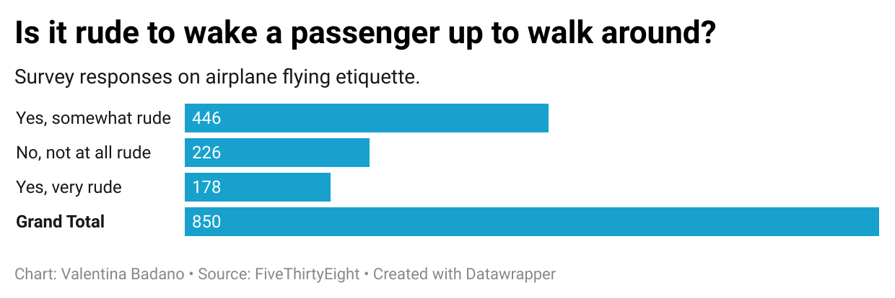

# j124 Assignment 4

## Is it rude to wake a passenger up if you are trying to walk around? 

This is the question that I chose to analyze based off of the flight etiquette survey data provided by *FiveThirtyEight*. 

Using a pivot table, I found that of **850** total survey responces, **446** people said "Yes, somewhat rude", **226** said "No, not at all" and **178** said "Yes, *very* rude". 

I chose this question to analyze because I was genuinly curious if people thought negatively about waking others up on a plane to walk around. I have been lucky enough to travel with my family or close friends for the majority of the times that I have been on longer flights, so I didn't feel particularly bad about asking to get up, and they didn't feel bad asking me to either. However, I will be taking a 16-hour flight alone this winter and perhaps this survey will impact my choices!? 

The data didn't specify in each question the length of the flights that respondants were basing their answers on. I would say that for a shorter flight, I agree that it is *"somewhat rude"*, however for longer flights, I think asking the seats next to you to let you out can be necessary - if they have been asleep for a long time. Ultimately however, this question is highly circumstantial. 

